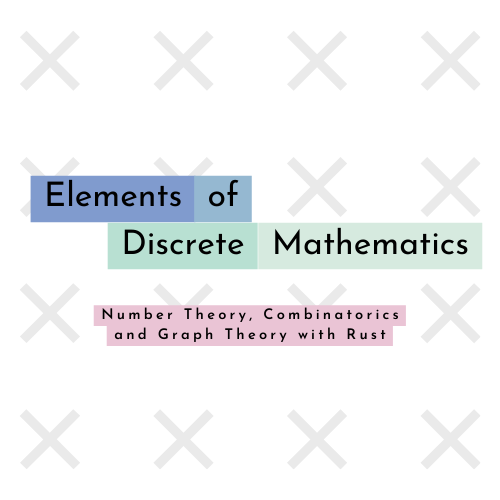

# Elements of Discrete Mathematics with Rust

This repository provides simple code snippets and implementations in Rust programming language for understanding various topics in discrete mathematics. The code examples and explanations are designed to be easy to understand, making it accessible for beginners to learn and apply these mathematical concepts in Rust.

## Authors

- Guilherme Marcello \<[@guilherme-marcello](https://github.com/guilherme-marcello)\>

## Part A: Number Theory

### [0: ](./0-euclidian-algorithm/0.md) Euclid's Algorithm (Extended)

`euclid.rs` provides an implementation of Euclid's algorithm for finding the greatest common divisor (GCD) of two integers. It also includes an extended version that computes the coefficients of Bézout's identity, which can be used for solving linear Diophantine equations.

### [1: ](./1-invertibility-divisibility/1.md)  Invertibility and Divisibility on $ℤ_n$

`invertibility_and_divisibility.rs` demonstrates the concepts of invertibility and divisibility on modular integers ($ℤ_n$). It includes code snippets for checking if an integer is invertible (i.e., has a multiplicative inverse).

### 2: Modular Arithmetic

`modular_arithmetic.rs` provides an implementation of a `ModInteger` struct and how to perform modular arithmetic operations such as addition, subtraction, multiplication, and exponentiation with this struct.

### 3: Solving Linear Modular Equations (Including Systems)

`linear_modular_equations.rs` provides an implementation for solving linear modular equations and systems of equations using the Chinese Remainder Theorem (CRT) and Gaussian Elimination. It includes code examples for finding solutions to congruences and systems of congruences.

### 4: Theorems of Fermat and Euler; The Totient Function

`fermat_euler_totient.rs` introduces the theorems of Fermat and Euler, which are important results in number theory related to modular arithmetic. It includes code snippets for computing Euler's totient function and checking if a number is a Fermat or Euler pseudoprime.

### 5: RSA Cryptography

`rsa_cryptography.rs` provides an implementation of the RSA cryptography algorithm, which is widely used for secure communication and data encryption. It includes code examples for generating RSA key pairs, encrypting and decrypting messages using RSA, and implementing the RSA digital signature scheme.

## Part B: Combinatorics and Graph Theory

### 6: Binomial and Multinomial Numbers

`binomial_multinomial_numbers.rs` demonstrates the concepts of binomial and multinomial numbers, which are important in combinatorics. It includes code snippets for calculating binomial and multinomial coefficients and generating Pascal's Triangle.

### 7: Generator Functions and Linear Recurrence Problems

`generator_functions_linear_recurrence.rs` provides an implementation of generator functions and linear recurrence problems, which are used to model various real-world problems. It includes code examples for generating sequences using linear recurrence relations and finding closed-form expressions for sequences.

### 8: General Principles of Counting

`general_principles_of_counting.rs` explains the general principles of counting, including permutations, combinations, and the multiplication and addition principles. It includes code snippets for calculating permutations, combinations, and counting arrangements in different scenarios.

### 9: Symmetric Counting Problems

`symmetric_counting_problems.rs` covers symmetric counting problems, including the principle of inclusion-exclusion, derangements, and counting problems with symmetry. It includes code examples for solving symmetric counting problems and calculating derangement numbers.

### 10: Graphs and Their Matrices; Planar Graphs and Duality

`graphs_and_matrices.rs` introduces graphs and their representations using matrices, including adjacency matrices and incidence matrices. It also covers planar graphs and duality, which are important concepts in graph theory. It includes code snippets for representing and manipulating graphs using matrices.

### 11: Algorithms with Trees and Paths

`algorithms_with_trees_and_paths.rs` provides an overview of algorithms

## Feedback

If you have any feedback, please reach out to me at guilemosmarcello@gmail.com

## License

MIT
